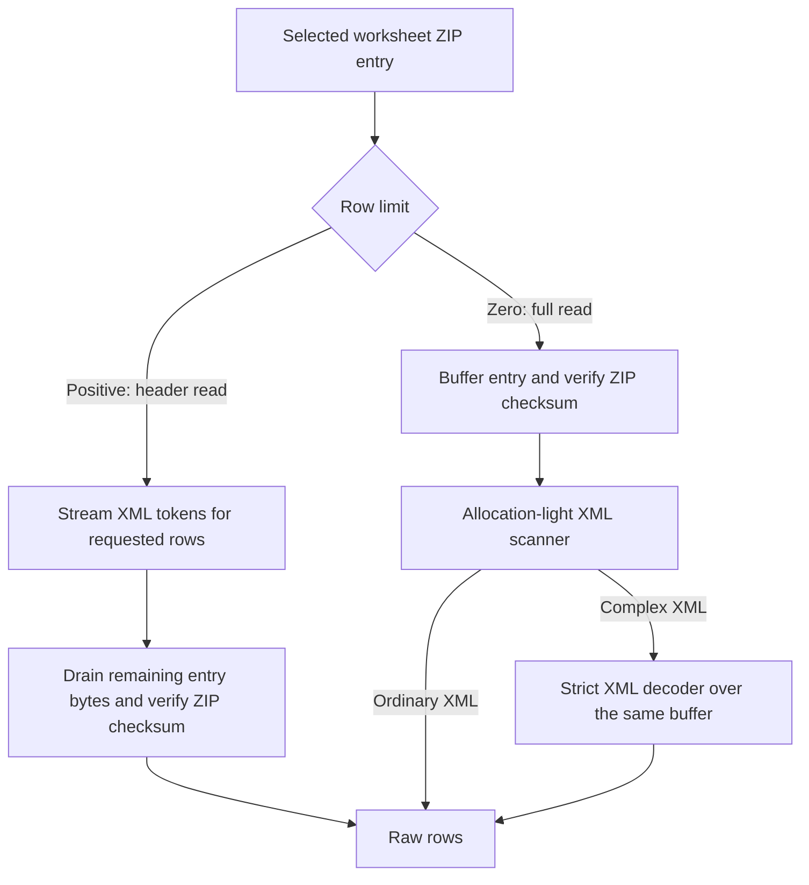
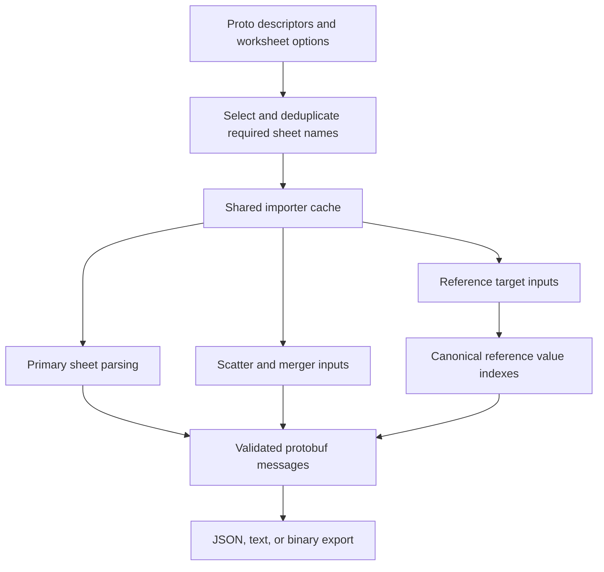

# Excel reader optimization design

## Purpose and scope

Read only the workbook data required by generation, reuse decoded data within
one load scope, and reduce worksheet parsing allocations without changing raw
cell values or generated outputs.

This document describes two related stages:

- [PR #456: profile and accelerate confgen sheet parsing](https://github.com/tableauio/tableau/pull/456),
  merged on September 29, 2026, established profiling, selective OOXML reading,
  importer/reference reuse, and cheaper JSON export.
- [PR #461: accelerate XLSX imports for proto and config generation](https://github.com/tableauio/tableau/pull/461)
  extends header-only protogen reads and introduces the current hybrid
  worksheet decoder. Its full-sheet path addresses an allocation regression
  discovered while comparing confgen against the #456 baseline.

The current reader is a focused OOXML raw-row reader, not a replacement for a
general-purpose Excel library. OOXML describes the workbook's ZIP parts and
relationships; SAX-style XML token processing is one decoding technique used
inside that format. They are complementary, not competing designs.

## Architecture and responsibilities

Generation code works with importers and workbook/sheet abstractions. Excel
planning works with the common `excelRowReader` interface:

```go
type excelRowReader interface {
    SheetNames() []string
    ReadRows(sheetName string, limit uint) ([][]string, error)
    Close() error
}
```

`limit == 0` means a full-sheet read. A positive limit requests the first N
logical rows, including gaps in row numbering, not N nonempty rows.

Backend details stay below this interface:

- [excel.go](../internal/importer/excel.go) selects sheets, plans row limits,
  reads the metasheet, and assembles a `book.Book`.
- [excel_reader.go](../internal/importer/excel_reader.go) adapts the focused
  reader and Excelize, including raw-value options and backend error mapping.
- [cache.go](../internal/importer/cache.go) owns reusable sources and decoded
  sheets. It stores an interface, not a second exposed `*excelize.File` handle.
- [xlsx/reader.go](../internal/importer/xlsx/reader.go) owns the ZIP archive,
  part index, sheet index, and shared-string loading state.
- [xlsx/parts.go](../internal/importer/xlsx/parts.go) resolves workbook and
  worksheet relationships. [archive.go](../internal/importer/xlsx/archive.go)
  handles entry size checks, reads, and ZIP integrity checks.
- [worksheet.go](../internal/importer/xlsx/worksheet.go) chooses bounded or
  full reads. [worksheet_fast.go](../internal/importer/xlsx/worksheet_fast.go)
  handles ordinary full-sheet XML without per-tag token allocations.
- [rows.go](../internal/importer/xlsx/rows.go) contains the strict streaming
  decoder and the shared row/cell builder used by both worksheet decoders.
- [shared_strings.go](../internal/importer/xlsx/shared_strings.go),
  [xml.go](../internal/importer/xlsx/xml.go), and
  [escapes.go](../internal/importer/xlsx/escapes.go) isolate shared-string,
  XML-text, and OOXML escape handling.
- [xml_fast.go](../internal/importer/xlsx/xml_fast.go) contains the common
  tag/text scanner used by worksheet decoding and shared-string indexing.
- [shared_string_index.go](../internal/importer/xlsx/shared_string_index.go)
  indexes ordinary shared-string XML and caches only requested decoded values.

Direct non-protogen Excel imports retain the Excelize path. Protogen and the
cached confgen Excel path try the focused reader first.

## Opening an OOXML workbook

1. Open the ZIP and index normalized entry names. Reject invalid or duplicate
   archive paths instead of resolving an ambiguous part.
2. Locate the workbook through the root office-document relationship, with
   the conventional `xl/workbook.xml` path as the supported fallback.
3. Read workbook metadata and its relationship part using standard XML
   unmarshaling. Resolve sheet names to worksheet ZIP entries; discover the
   shared-string part through its relationship or conventional path.
4. Reject missing worksheet parts and invalid metadata. Non-worksheet sheet
   relationships, such as chart, dialog, or macro sheets, signal
   `ErrUnsupported` so the caller can use Excelize.
5. Inflate selected worksheet entries only. Styles, drawings, and unrelated
   worksheets are not decoded into a general workbook model.

The reader returns raw strings. It does not apply Excel display formatting,
evaluate formulas, execute macros, or edit workbooks. Formula cells use stored
cached values; a formula with an empty value still affects row placement.

Shared-string loading depends on the read workflow. Full confgen reads retain
the complete-table decoder, loaded once per reader. Protogen uses selective
shared strings for both header reads and the complete metasheet: the first
shared-string cell initializes a validated index, and only referenced values
are decoded and cached. Inline-only reads do not load the string table.

### Selective shared-string workflow

1. On the first `t="s"` cell, read the shared-string ZIP entry completely,
   enforcing its size limit and verifying its checksum.
2. Scan ordinary XML to validate tags, text, and structure and record each
   `<si>` item's byte span. The index covers the complete entry, including
   unused items; it does not trust the declared unique-count attribute.
3. Resolve a cell's integer index to its span and decode that item using the
   existing rich-text decoder and OOXML escape conversion. Cache empty strings
   as well as nonempty ones. Repeated indexes and subsequent sheets reuse values.
4. If the table contains XML outside the index scanner's supported syntax,
   replay its already-read bytes through the strict complete-table decoder.
   UTF-16, namespace-prefixed tags, CDATA, and comments remain compatible through
   this path. Malformed XML and invalid references remain errors.

Ordinary rich-text runs and phonetic annotations can be indexed without decoding
unrequested values. The shared row builder resolves values before placing cells,
so empty shared strings still produce the same sparse-row layout as full reads.

Selective loading reduces XML token allocations and decoded-string construction;
it still decompresses and validates the complete table once and retains its
XML buffer and span index. It is not selective ZIP decompression. The index and
its decoded-value cache are protected for concurrent reads. `ReadRowsN`, including
its zero-limit form, uses this path; `ReadRows` preserves full-table loading for
the confgen adapter.

## Two worksheet read paths



### Bounded reads: less parsing, not partial ZIP validation

The strict streaming decoder collects the requested logical rows, then stops
building rows. The remaining entry bytes are drained with `io.Copy` to
`io.Discard` so the ZIP reader reaches the end and checks its CRC32.

Without draining, a valid header could hide a corrupt or truncated entry tail.
That is why a header-only read cannot simply return after parsing its last
requested row. Closing a ZIP entry does not substitute for consuming it.

The tradeoff is explicit: the selected sheet is still fully decompressed, but
its unused tail is neither retained as worksheet data nor XML-tokenized.
Draining checks ZIP integrity, **not XML well-formedness of the unparsed tail**.
A valid-checksum XML syntax error beyond the consumed header is not guaranteed
to be detected by a bounded read. Full reads parse the complete worksheet.

### Full reads: fewer allocations

Confgen needs all selected rows. A token decoder allocating start/end tags,
attributes, and character-data objects for every cell can dominate CPU and
allocation even though the workbook selection and caches are already effective.

The full-read path therefore:

1. Reads the entry into a bounded buffer and verifies entry completion and CRC.
2. Scans ordinary XML tags, attributes, and text spans directly from that buffer.
3. Validates matching tags, attribute syntax, UTF-8, XML characters, and cell
   semantics without creating a complete XML token stream for ordinary cells.
4. Uses standard XML decoding for text that requires entity handling.
5. Replays complex markup through the strict XML decoder over the **same
   already-inflated buffer**, rather than reopening or decompressing the file.

CDATA, comments, processing instructions, and namespace-qualified or complex
markup are reasons to use the strict decoder, not automatic reasons to reopen
the workbook through Excelize. Ordinary Unicode text remains on the fast path.

This is intentionally a limited fast path backed by a standard decoder, not a
second general XML implementation. Strict decoding supports common named HTML
entities through `xml.HTMLEntity`, including `&nbsp;`. DOCTYPE declarations are
classified as unsupported rather than introducing custom DTD processing.

UTF-16 parts are detected from their BOM or initial XML declaration bytes and
transcoded before strict XML decoding. Little-endian and big-endian forms are
supported, with or without a BOM. This applies to worksheets, shared strings,
and workbook metadata. Other declared charsets signal `ErrUnsupported` for
Excelize fallback; malformed UTF-8 remains a data error.

### Shared row semantics

Both decoders use `worksheetRows` for sparse-row padding, cell placement,
duplicate coordinates, repeated row numbers, formula placement, and conversion
of cell values. Decoder selection must not change the resulting header mapping.

Shared and inline strings support OOXML `_xNNNN_` escapes and rich-text runs;
phonetic annotation text is excluded. Cells with `t="str"` retain their stored
value without applying the OOXML escape conversion used for other cell types.
Invalid shared-string indexes and invalid row/cell coordinates are errors,
not requests to try another backend.

## Protogen workflow

1. Open the workbook and enumerate available sheets, respecting an explicit
   sheet selection.
2. When a metasheet parser is available and the import is not cloned, read the
   entire metasheet (`@TABLEAU` by default) before reading data sheets.
3. Parse its settings to plan the reads. On the focused-reader path, a nonempty
   metasheet listing filters out unrelated sheets.
4. For ordinary, non-transposed default-mode sheets, request the default first
   10 rows. Transposed and special-mode sheets keep full reads because their
   data may contribute to schema generation. With no metasheet, the ordinary
   planning path uses the default header limit.
5. Reuse the already-read metasheet when assembling the book; do not read it
   again or defensively duplicate all its rows. Metasheet parsing is read-only.
   Its full worksheet read still selects shared strings on demand rather than
   forcing the entire table to be decoded before ordinary sheet headers.
6. Parse metadata, purge unneeded sheets, and generate protos as usual.

The speedup comes primarily from avoiding XML parsing and row construction for
ordinary data rows, not from skipping the worksheet checksum or changing proto
semantics. Custom/cloned import paths are not automatically equivalent to this
normal metasheet-planning workflow.

## Confgen workflow and PR #456

PR #456 optimizes the complete configuration pipeline, not just a worksheet
parser. The current reader keeps these optimizations rather than replacing them.



### Selected sheets and shared importer data

Confgen resolves workbook and worksheet options from proto descriptors, applies
format filters and subdirectory rewrites, and deduplicates physical sheet names
before loading them. Multiple messages can use the same sheet without requiring
multiple decodes. Primary imports, reference checks, scatter, and merger inputs
all use the same generator-owned importer cache.

The cache separates three responsibilities:

- **Importer views:** an exact key includes the cleaned logical filename,
  ordered sheet selection, importer mode, cloned flag, and primary book name.
  Sheet names are NUL-separated to avoid separator collisions.
- **Sources:** different views share the opened format-specific source. A
  singleflight group prevents concurrent requests from opening it repeatedly.
- **Decoded sheets:** Excel and CSV sources decode requested sheets lazily and
  retain them for subsequent views. XML/YAML sources share parsed document
  trees through filtered book views.

CSV filenames are normalized to the logical book pattern, so related sheet
files can share a source. Path cleaning is not a claim of filesystem identity:
the cache does not resolve every alias, symlink, or differently cased path.

Each cached Excel source has one mutex covering its reader, decoded-sheet map,
and fallback state. Requests for one workbook serialize at this boundary;
different workbook sources can load concurrently. Consumers must treat cached
rows and document trees as immutable and keep parser-specific state separate.
Protogen and custom-parser loads bypass this reusable cache because their
mutation/state semantics are not suitable for shared importer views.

### Reference validation

The reference cache has a separate purpose from the importer cache:

1. Normalize a raw refer expression once within its proto-package context.
2. Resolve it to `<fully-qualified-message-name>.<column-name>`.
3. Publish an in-flight entry for that canonical target before loading it.
4. Use the shared importer cache to read the target worksheet and any merger
   inputs; build the target column's allowed-value index.
5. Let concurrent checks for the same target wait on its ready channel, then
   reuse the index. Unrelated targets can load concurrently.

Aliases resolving to the same message column share a value index. Failed loads
are marked unavailable; the loading caller reports the error without flooding
the collector with duplicate errors from every waiting cell.

See [refer.go](../internal/confgen/fieldprop/refer.go) for normalization,
in-flight publication, and value-space construction.

### Runtime loads and cache lifetime

PR #456 also shares importer/reference caches among messager options in one
parsed runtime load-options scope. A directly constructed `MessagerOptions`
without shared caches receives a fresh cache for the call.

Caches belong to their generator or load-options scope, not to a process-global
registry. They have no per-load `Release`, explicit `Cache.Close`, or eviction
step. Lifetime follows the owning object; retained sources own workbook handles
and decoded data. This simplifies coordination but is not a deterministic
handle-close API or an unlimited-lifetime caching recommendation.

Inputs must remain stable while a cache is reused. There is no mtime/content
invalidation. Create a new generator or load-options scope when inputs change;
the confgen generator is intended for one generation run.

See [load/options.go](../load/options.go) and
[confgen.go](../internal/confgen/confgen.go).

### JSON export

PR #456 removes unnecessary post-marshal JSON tree rewriting:

- Official `protojson` behavior remains responsible for protobuf JSON semantics.
- When timezone output is requested, a read-only reflection view presents
  timestamps as localized strings during that traversal. The source message is
  not mutated; messages without reachable timestamps avoid this wrapper work.
- `json.Compact` or `json.Indent` normalizes whitespace without decoding and
  rebuilding the whole JSON object tree.

This preserves existing output formatting; it does not claim canonical JSON
ordering across arbitrary future protobuf-library versions. See
[marshal.go](../store/marshal.go) and [protojson.go](../store/protojson.go).

## Fallback and error contracts

There are two distinct fallback levels:

1. **Worksheet decoder fallback:** ordinary scanner to strict XML decoder over
   the same bytes. This accommodates valid complex XML without a second ZIP
   read or an Excelize workbook model.
2. **Workbook backend fallback:** focused reader to Excelize, only when
   `errors.Is(err, xlsx.ErrUnsupported)` is true. Examples include unsupported
   sheet relationship types, encountered DOCTYPE declarations, and declared
   charsets that the focused reader does not handle.

Protogen retries the entire import with Excelize to keep one consistent backend
for that import. A cached confgen source switches its reader permanently after
an unsupported sheet, discards its previously decoded sheets, and rebuilds the
current import view using Excelize. Already published views remain immutable
snapshots; subsequent decoding uses the replacement reader. Backend switches
are debug-logged. If compatibility loading also fails, joined errors preserve
both causes.

Missing/corrupt archives, checksum failures, invalid cell coordinates, and bad
shared-string indexes are not generic fallback triggers. Opening failures retain
the importer-level E3002 contract; missing requested sheets are mapped through
the common importer error contract. Retrying every error would double work for
deterministically invalid data and could hide the original diagnosis.

The 512 MiB uncompressed per-entry limit is a hard error, so oversized parts
cannot bypass it by triggering backend fallback. It does not bound total cache
memory. Full-sheet buffers and
decoded strings still require memory proportional to selected worksheet data.

## Profiling and verification workflow

The [profiling guide](profile/profiling.md) provides the operational commands.
For a configured workspace, run each mode separately from its expected working
directory:

```powershell
$ConfigFile = "<path-to-config.local.yaml>"
tableauc --mode proto --config $ConfigFile --profiling
tableauc --mode conf --config $ConfigFile --profiling
```

Profiles are written to the configured generator output directory/subdirectory
as `<generator>-cpu.pprof` and `<generator>-mem.pprof`. Preserve each build's
artifacts separately because subsequent runs reuse those filenames.

```powershell
go tool pprof -top .\confgen-cpu.pprof
go tool pprof -tags .\confgen-cpu.pprof
go tool pprof -top -sample_index=alloc_space .\confgen-mem.pprof
go tool pprof -top -sample_index=inuse_space .\confgen-mem.pprof
```

Profiling labels distinguish generator, phase/work or operation name, source,
reader, book, sheet, message/parse pass, and canonical refer target where
applicable. Sheet metrics combine sampled CPU, wall time, and input shape;
protogen book-operation metrics include calls, failures, total/max wall time,
and inclusive sampled CPU. Inherited context and distinct `operation.*` labels
preserve parent-operation attribution during nested measurements.

Concurrent wall times overlap, and inclusive parent CPU overlaps child CPU:
neither should be added as if it were a sequential run duration. Allocation
space measures allocation churn, not peak RSS; in-use space measures retained
heap at the snapshot. Cache counters report requests, opened sources, decoded
sheets, and unique logical paths, and are enabled only for profiling.

A performance change should follow this workflow:

1. Pin baseline/candidate commits, Go version, configuration, working directory,
   inputs, proto descriptors, and output settings. Confirm both builds can
   successfully process the dataset before comparing them.
2. Save output manifests containing relative filenames and SHA-256 hashes.
   Compare file sets as well as contents, including protos and all config
   formats; do not omit stale or missing files from the comparison.
3. Warm each build, then alternate at least five successful **non-profiled**
   runs per version and mode. Retain raw samples and compare medians; more
   samples are needed for a meaningful tail-latency estimate.
4. Collect separate CPU/allocation profiles and metrics to explain a difference.
   Do not treat profiled wall time as normal runtime.
5. Compare outputs after runs and investigate failures separately rather than
   silently counting failed generation as a fast sample.
6. Run row-parity tests, corruption/error tests, allocation benchmarks, and
   relevant generation tests before retaining the change.

The acceptance criterion is end-to-end performance with unchanged outputs,
not a lower microbenchmark allocation count alone.

## Measured results and their boundaries

### Historical PR #456 evidence

The [PR #456 description](https://github.com/tableauio/tableau/pull/456)
reports separate production-sized Windows experiments:

- Selective XLSX reading: median 5.698 s to 2.364 s (2.41x); profiled allocation
  6.57 GB to 2.38 GB; sampled CPU 21.83 CPU-s to 11.30 CPU-s.
- JSON-path optimization: median 1.942 s to 1.828 s; total allocation
  2,433 MB to 1,766 MB.
- One-pass timestamp handling: an additional 0.7-1.4% median improvement in
  that experiment; `MarshalToJSON` allocation 392 MB to 314 MB.
- Verification: 458 JSON and 23 binary outputs were byte-identical, and the
  selective reader matched Excelize across 46 repository XLSX fixtures.

These measurements describe different optimization stages. They must not be
added or multiplied into a single speedup, or presented as new measurements of
the current reader. Cache-lifetime simplification has no separate speed claim.

### Current hybrid-reader verification

The October 2, 2026 production comparison used Windows amd64, Go 1.26, an
Intel Core i7-13700, and five successful alternating normal-mode runs per build.
The baseline was commit `2dc6dc71e8fa87ae42688c93e4ce5faab8bbbcfd`, the merged
#456 state. The candidate implementation was verified on the #461 branch,
including commit `82d82ed76bdbc73ad48182bfecb2267888475169`.

- Protogen median: 1.956 s to 0.787 s, approximately 2.48x faster.
- Confgen median: 1.895 s to 1.876 s, approximately baseline performance. The
  roughly 1% difference is not evidence of a substantial additional speedup.
- All 694 outputs matched byte-for-byte: 194 protos, 477 JSON, and 23 binary.
- Full and bounded row reads were checked against Excelize across 457 production
  workbooks, alongside repository parity, corruption, fuzz, and allocation tests.

The earlier full-sheet token-decoder revision regressed confgen. A profile
attributed roughly 61% of its allocation to XML token processing; the hybrid
decoder removed that regression rather than relying on importer-cache changes.
In fresh profiles, total confgen allocation was approximately 1,741 MiB for the
baseline and 1,746 MiB for the candidate, consistent with baseline-level cost.

The newer master commit `15996dec31b38ee72b394be1fbc8687eedcbbe6d` introduced
incell-struct E2031 validation through #459 and could not process that production
configuration unchanged. Therefore these numbers compare against the explicitly
pinned #456 baseline, not an unspecified moving master. The #456 and #461 output
counts also differ; they are not interchangeable datasets for timing claims.

### Selective shared-string follow-up

A 50,000-item ordinary string-table benchmark requesting ten widely spaced
indexes measured three runs per path on the same Windows/amd64 machine:

- Complete decoding: median 37.2 ms, approximately 25.7 MB allocated, and
  approximately 600,000 allocations; all 50,000 strings were decoded.
- Selective indexing and lookup: median 6.0 ms, approximately 4.4 MB allocated,
  and 219 allocations; ten strings were decoded.

These are isolated parser measurements with the input XML already in memory,
not complete generation timings or peak-memory measurements. The complete
confgen table decoder remains in use. Differential fuzzing passed 243,037
executions, and complete/bounded rows matched Excelize across all 457 production
workbooks. Tests cover cache reuse, empty values, rich text, escapes, malformed
unused items, and shared-string ZIP checksums.

The previously measured full production dataset could no longer complete with
the unchanged baseline during this follow-up: protogen reported an undefined
`.StarAIBanPick`, and confgen reported missing `MonsterPack` columns. Those failed
runs are excluded from speedup claims. Subsequent generation comparisons use
isolated output directories; baseline and candidate outputs are compared using
the same current inputs and settings.

## Maintenance rules and remaining limits

- Keep backend-specific APIs in adapters and raw worksheet decoding in `xlsx`.
  Do not move Excelize or ZIP details back into Excel planning code.
- Keep row placement and cell conversion in one shared builder. Extend both
  decoder parity tests whenever supported cell behavior changes.
- Keep complex XML on the standard-decoder path rather than growing an
  unrestricted custom parser. Preserve diagnostics on malformed input.
- Never skip entry completion/CRC verification to claim a header-read speedup.
- Gate backend fallback on capability errors; do not suppress corrupt-data errors.
- Keep cached inputs immutable and cache ownership explicit. Do not add a
  process-global cache without an invalidation and resource-lifetime design.
- Test sparse/duplicate rows and cells, Unicode, rich text, escapes, entities,
  namespaces, CDATA, formulas, missing parts, unsupported relationships, size
  limits, and corrupt ZIP tails. Include end-to-end output comparisons.
- Measure shared-string indexing, lookup, and retained buffers separately before
  extending the index scanner. Complex-table selective decoding, streaming
  all-row consumption, and deterministic cache shutdown remain possible work.

Relevant tests live in [xlsx](../internal/importer/xlsx),
[cache_xlsx_test.go](../internal/importer/cache_xlsx_test.go), and
[excel_test.go](../internal/importer/excel_test.go). On Windows, run tests without
`-race` when CGO is disabled. Documentation of a fast path is not permission to
weaken its compatibility or integrity contracts.
