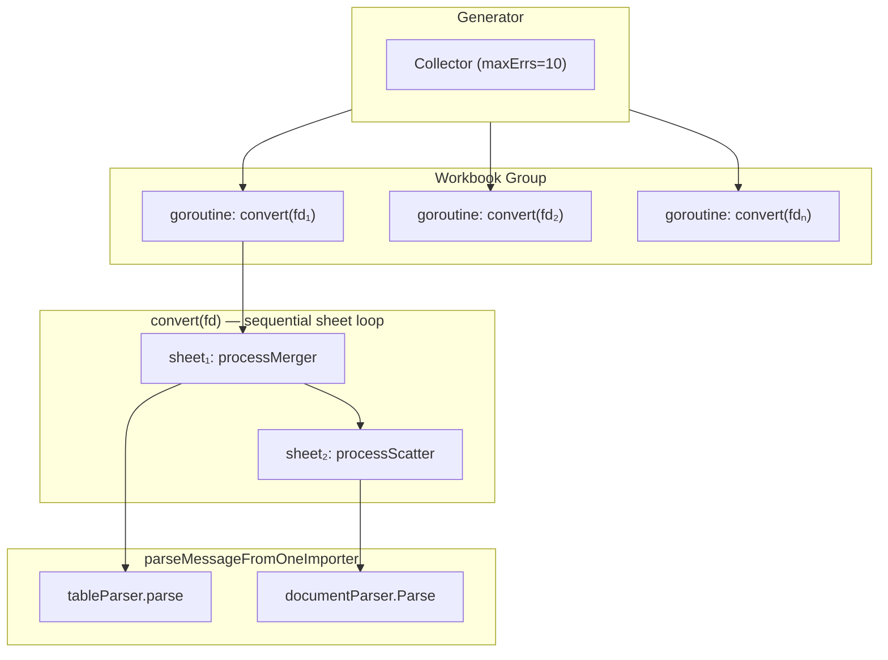
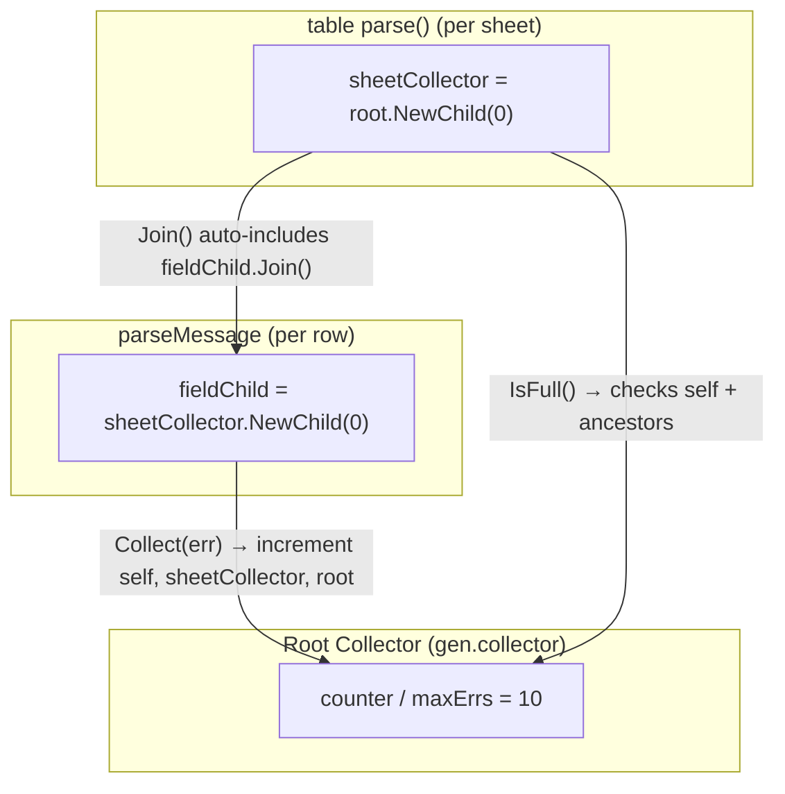

# confgen — Configuration Generation

Converts workbook data (Excel/CSV/XML/YAML) into protobuf messages with
concurrent parsing and a shared error collector for global error limiting.

## Parsing Hierarchy

```
Generator
 ├── GenAll / GenWorkbook
 │    └── collector.NewGroup(ctx)               ← concurrent workbook batch
 │         └── Group.Go(convert)                ← one goroutine per proto file
 │
 └── convert(fd)                                ← sequential per-sheet within one workbook
      ├── processScatter → ScatterAndExport
      │    ├── parseMessageFromOneImporter      ← main sheet
      │    └── collector.NewGroup(ctx)          ← concurrent scatter batch
      │         └── Group.Go(parseMessageFromOneImporter)
      │
      └── processMerger → MergeAndExport
           └── ParseMessage
                ├── single importer → parseMessageFromOneImporter
                └── multiple importers
                     └── collector.NewGroup(ctx)       ← concurrent merge batch
                          └── Group.Go(parseMessageFromOneImporter)
```

### parseMessageFromOneImporter (leaf)

```
parseMessageFromOneImporter(info, collector, impInfo)
 └── sheetParser.Parse(protomsg, sheet)
      ├── [document sheet] → documentParser.Parse
      │    └── parseMessage (recursive tree walk)
      │
      └── [table sheet]    → tableParser.Parse
           └── tableParser.parse
                └── RangeDataRows(row callback)
                     └── parseMessage (per row)
```

## Concurrent Model



| Level             | Mechanism                 | Description                                          |
| ----------------- | ------------------------- | ---------------------------------------------------- |
| **Workbook**      | `collector.NewGroup(ctx)` | One goroutine per proto file                         |
| **Scatter/Merge** | `collector.NewGroup(ctx)` | Sub-importers parsed concurrently                    |
| **Sheet (table)** | `RangeDataRows` callback  | Rows parsed sequentially; shared collector fail-fast |

## Error Collector

### Hierarchy

Errors are counted at **field level**. The `Collector` forms a tree via
`NewChild(maxErrs)` — each level has its own limit. `Collect()` increments
counters on self and all ancestors; `Join()` recursively assembles the tree.



### API

```go
func NewCollector(maxErrs int) *Collector              // 0=unlimited, 1=fail-fast, N=stop after N
func (c *Collector) NewChild(maxErrs int) *Collector   // child with its own limit
func (c *Collector) Collect(err error) bool            // store + count on self & ancestors; true if full
func (c *Collector) IsFull() bool                      // true if any ancestor is full
func (c *Collector) Join() error                       // recursive: self.errs + children[i].Join()
func (c *Collector) NewGroup(ctx context.Context) *Group
func (g *Group) Go(fn func(ctx context.Context) error)
func (g *Group) Wait() error                           // returns collector.Join() with collected marker
```

| Method      | Behavior                                             |
| ----------- | ---------------------------------------------------- |
| `Collect()` | Store locally, increment counter on self & ancestors |
| `IsFull()`  | Walk self → parent → root, true if any level full    |
| `Join()`    | Recursive: own errs + children's `Join()`            |

### Error Flow

```
Field parse error
  → fieldChild.Collect(err)                      # store locally, count on self & ancestors
  → fieldChild.Join()                            # join all field errors in this message
  → sheetCollector.Join()                        # auto-includes all fieldChildren (table only)
  → WrapKV(err, BookName, SheetName, Message)    # add sheet context
  → gen.collector.Collect(wrappedErr)            # store + check global limit
  → gen.collector.Join()                         # recursive join of entire tree
```

### Collected Marker

`Group.Wait()` returns `collector.Join()` wrapped with a `collected` marker.
When this error propagates to an outer `Collect()`, the marker tells it to
skip storing — the errors are already in the tree via `NewChild`.

| Scenario                        | Behavior                                |
| ------------------------------- | --------------------------------------- |
| `Collect(plainErr)`             | Stored normally, counter incremented    |
| `Collect(collectedErr)`         | Skipped (already in tree)               |
| `Collect(WrapKV(collectedErr))` | Skipped (`errors.As` sees through wrap) |
