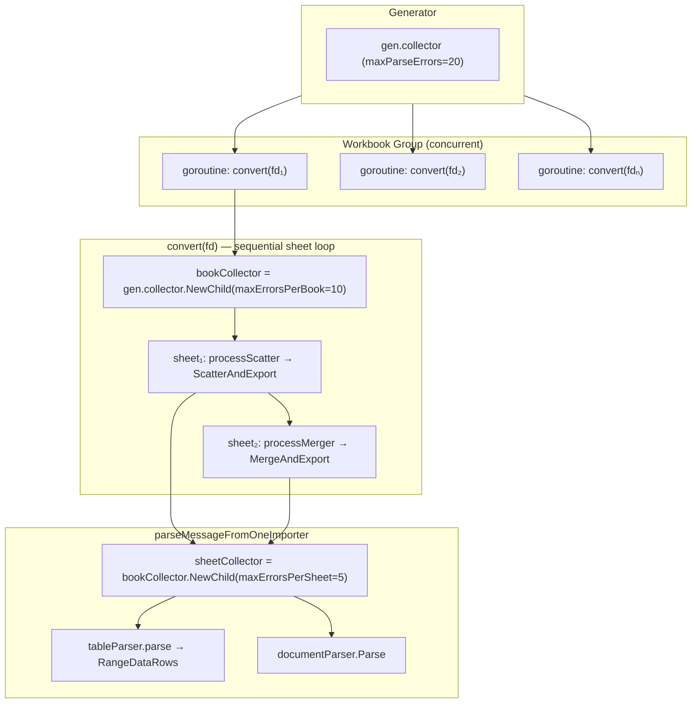
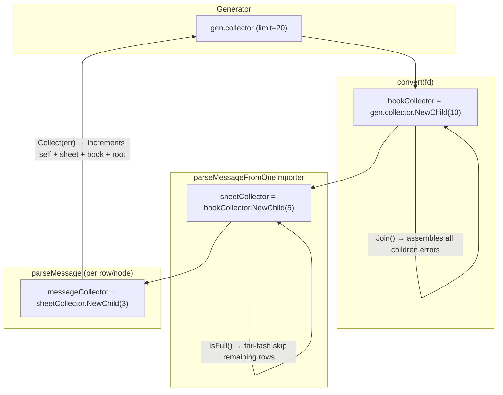

# confgen — Configuration Generation

Converts workbook data (Excel/CSV/XML/YAML) into protobuf messages with
concurrent parsing and a hierarchical error collector for multi-level error limiting.

## Parsing Hierarchy

```
Generator
 ├── GenAll / GenWorkbook
 │    └── collector.NewGroup(ctx)                    ← concurrent workbook batch
 │         └── Group.Go(convert)                     ← one goroutine per proto file
 │
 └── convert(fd)                                     ← sequential per-sheet loop within one workbook
      ├── processScatter → ScatterAndExport
      │    ├── parseMessageFromOneImporter(main)      ← main importer: sequential
      │    └── collector.NewGroup(ctx)                ← concurrent scatter batch
      │         └── Group.Go(parseMessageFromOneImporter)
      │
      └── processMerger → MergeAndExport
           └── ParseMessage
                ├── single importer → parseMessageFromOneImporter   ← sequential
                └── multiple importers
                     └── collector.NewGroup(ctx)                    ← concurrent merge batch
                          └── Group.Go(parseMessageFromOneImporter)
```

### parseMessageFromOneImporter (leaf)

```
parseMessageFromOneImporter(info, collector, impInfo)
 └── sheetCollector = collector.NewChild(maxErrorsPerSheet=5)
 └── sheetParser.Parse(protomsg, sheet)
      ├── [document sheet] → documentParser.Parse
      │    └── parseMessage(node)                    ← recursive tree walk
      │         └── messageCollector = sheetCollector.NewChild(maxErrorsPerMessage=3)
      │
      └── [table sheet]    → tableParser.Parse
           └── tableParser.parse
                └── RangeDataRows(row callback)
                     └── parseMessage(row)           ← per row
                          └── messageCollector = sheetCollector.NewChild(maxErrorsPerMessage=3)
```

## Concurrent Model



| Level         | Collector                                       | Limit | Scope                             |
| ------------- | ----------------------------------------------- | ----- | --------------------------------- |
| **Generator** | `gen.collector`                                 | 20    | across all concurrent workbooks   |
| **Book**      | `bookCollector = gen.collector.NewChild(10)`    | 10    | across sheets in one workbook     |
| **Sheet**     | `sheetCollector = bookCollector.NewChild(5)`    | 5     | across messages/rows in one sheet |
| **Message**   | `messageCollector = sheetCollector.NewChild(3)` | 3     | across fields in one message/row  |

## Error Collector

### Hierarchy

Errors are counted at **field level**. The `Collector` forms a tree via
`NewChild(maxErrs)` — each level has its own cap. `Collect()` increments
counters on self and all ancestors; when any level is full, further errors
are dropped at that level. `Join()` recursively assembles the error tree.



### Fail-fast Behavior

- **Message level**: stops iterating fields when `messageCollector.IsFull()`.
- **Sheet level**: `tableParser.parse` checks `sheetCollector.IsFull()` before each row; returns early if full.
- **Book level**: `convert` checks the error returned by `bookCollector.Collect()`; breaks the sheet loop if full.
- **Generator level**: `collector.NewGroup` propagates the first fatal error (book-full) to stop the workbook goroutine.