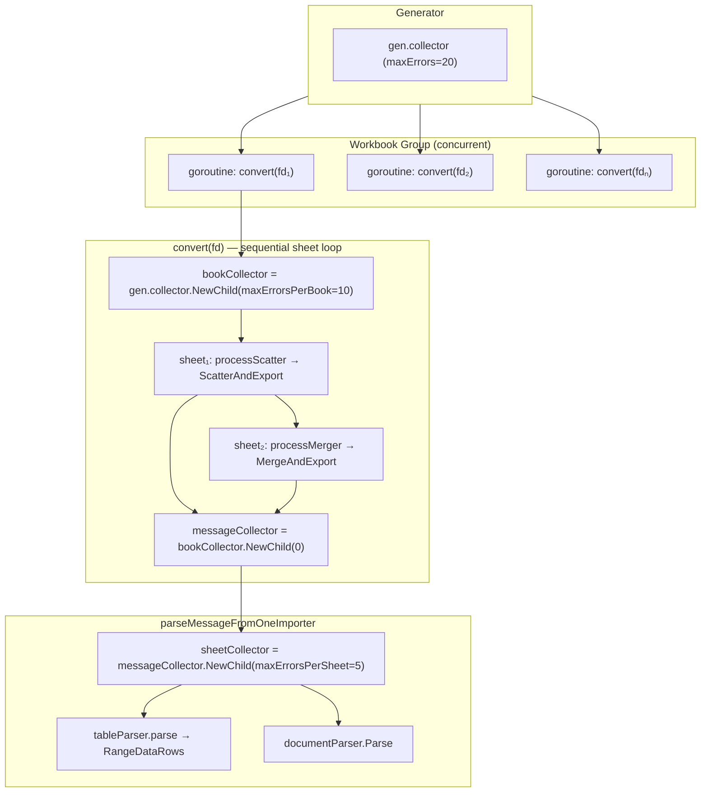
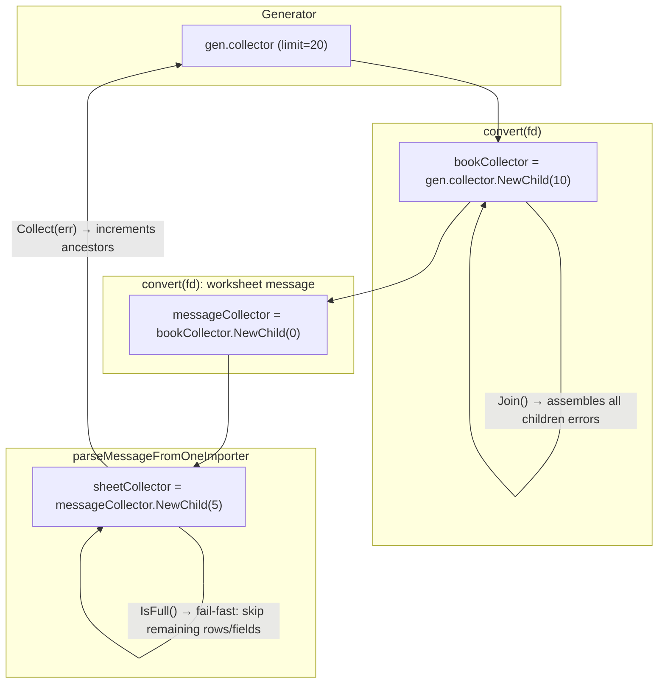

# confgen — Configuration Generation

Converts workbook data (Excel/CSV/XML/YAML) into protobuf messages with
concurrent parsing and a hierarchical error collector for multi-level error limiting.

## Parsing Hierarchy

```
Generator
 ├── GenAll / GenWorkbook
 │    └── collector.NewGroup(ctx)                    ← concurrent workbook batch
 │         └── Group.Go(convert)                     ← one goroutine per proto file
 │
 └── convert(fd)                                     ← sequential per-sheet loop within one workbook
      ├── processScatter → ScatterAndExport
      │    ├── parseMessageFromOneImporter(main)      ← main importer: sequential
      │    └── collector.NewGroup(ctx)                ← concurrent scatter batch
      │         └── Group.Go(parseMessageFromOneImporter)
      │
      └── processMerger → MergeAndExport
           └── ParseMessage
                ├── single importer → parseMessageFromOneImporter   ← sequential
                └── multiple importers
                     └── collector.NewGroup(ctx)                    ← concurrent merge batch
                          └── Group.Go(parseMessageFromOneImporter)
```

### parseMessageFromOneImporter (leaf)

```
parseMessageFromOneImporter(info, messageCollector, impInfo)
 └── sheetCollector = messageCollector.NewChild(maxErrorsPerSheet=5, BookName, SheetName)
 └── sheetParser.Parse(protomsg, sheet)
      ├── [document sheet] → documentParser.Parse
      │    └── parseMessage(node)                    ← recursive tree walk
      │
      └── [table sheet]    → tableParser.Parse
           └── tableParser.parse
                └── RangeDataRows(row callback)
                     └── parseMessage(row)           ← per row
```

## Concurrent Model


```mermaid
flowchart TB
    subgraph Generator
        C["gen.collector (maxErrors=20)"]
    end

    subgraph "Workbook Group (concurrent)"
        direction TB
        G1["goroutine: convert(fd₁)"]
        G2["goroutine: convert(fd₂)"]
        Gn["goroutine: convert(fdₙ)"]
    end

    Generator --> G1 & G2 & Gn

    subgraph "convert(fd) — sequential sheet loop"
        B["bookCollector = gen.collector.NewChild(maxErrorsPerBook=10)"]
        S1["sheet₁: processScatter → ScatterAndExport"]
        S2["sheet₂: processMerger → MergeAndExport"]
        M["messageCollector = bookCollector.NewChild(0)"]
    end

    G1 --> B --> S1 --> S2

    subgraph "parseMessageFromOneImporter"
        SC["sheetCollector = messageCollector.NewChild(maxErrorsPerSheet=5)"]
        TP["tableParser.parse → RangeDataRows"]
        DP["documentParser.Parse"]
    end

    S1 & S2 --> M --> SC --> TP & DP
```

| Level         | Collector                                      | Limit     | Scope                           |
| ------------- | ---------------------------------------------- | --------- | ------------------------------- |
| **Generator** | `gen.collector`                                | 20        | across all concurrent workbooks |
| **Book**      | `bookCollector = gen.collector.NewChild(10)`   | 10        | across sheets in one workbook   |
| **Message**   | `messageCollector = bookCollector.NewChild(0)` | unlimited | one worksheet message           |
| **Sheet**     | `sheetCollector = messageCollector.NewChild(5)` | 5         | one imported sheet              |

## Error Collector

### Hierarchy

Errors are counted at **field level**. The collector tree has limits at book
and imported-sheet levels; the message level groups errors without a separate
limit. `Collect()` increments counters on self and all ancestors. `Join()`
recursively assembles the error tree.

A child collector carries fields shared by its subtree. The book collector
supplies module and primary workbook context; the message collector supplies
the worksheet and protobuf message; each imported-sheet collector
supplies the actual workbook and worksheet names. `Join()` inherits these
fields into each error. `WrapKV` adds fields at the node it wraps; fields on an
individual error remain local to that error.


```mermaid
flowchart TB
    subgraph "Generator"
        Root["gen.collector  (limit=20)"]
    end

    subgraph "convert(fd)"
        Book["bookCollector = gen.collector.NewChild(10)"]
    end

    subgraph "convert(fd): worksheet message"
        Message["messageCollector = bookCollector.NewChild(0)"]
    end

    subgraph "parseMessageFromOneImporter"
        Sheet["sheetCollector = messageCollector.NewChild(5)"]
    end

    Root --> Book --> Message --> Sheet
    Sheet -- "Collect(err) → increments ancestors" --> Root
    Sheet -- "IsFull() → fail-fast: skip remaining rows/fields" --> Sheet
    Book -- "Join() → assembles all children errors" --> Book
```

### Fail-fast Behavior

- **Sheet level**: `sheetCollector.IsFull()` is checked before each row; returns early if full.
- **Book level**: `convert` checks the error returned by `messageCollector.Collect()`; breaks the sheet loop if an ancestor is full.
- **Generator level**: `collector.NewGroup` propagates the first fatal error (book-full) to stop the workbook goroutine.

## Sheet Performance Statistics

Use `tableauc --profiling` to collect these metrics and write
`confgen-cpu.pprof` and `confgen-mem.pprof` under the configured output
directory. Profiling is disabled by default; disabled runs skip pprof
collection, shape scans, CPU timing, OS-thread pinning, labels, and stats
aggregation.

The CPU profile spans the full generation run and includes all goroutines in
the process. Use its `confgen_sheet` label to isolate parser samples. The
memory file is a heap profile captured after garbage collection at the end of
the run, so it primarily reports retained allocations. Only one CPU profile
can run in a process at a time, and each run replaces the previous files.

GenAll and GenWorkbook log one row per imported workbook, sheet, and
protobuf message, including sheets used by scatter and merger. Repeated parses
of the same source are aggregated. The report sorts by cumulative **processor
time** when thread CPU accounting is available, then by parser wall time.
Processor time is user plus kernel time spent on the parser's OS thread.
Windows, Linux, and macOS support this measurement; short parses may round to
zero at the OS clock resolution. Other platforms show cpu=n/a and sort by wall
time. The parser runs synchronously on the measured thread. CPU profiles also
carry a confgen_sheet label for function-level analysis.

Wall time covers only sheetParser.Parse. It excludes workbook import, sheet
shape collection, validation, merging, and output. Concurrent wall durations
can overlap. The cpuCalls field shows how many parse calls returned a CPU
reading; failures counts calls whose parser returned an error, so their
timings may represent partial work.

For table sheets, rows is the total number of imported rows across calls,
including headers; maxCols is the widest row. The cells field is the full
rectangular grid for each call, summed across calls. Present counts nonempty
strings. Absent is the sum of empty (stored empty strings) and missing
(implicit cells beyond a short row). EmptyRows have no nonempty cells, and
valueBytes sums the UTF-8 byte lengths of nonempty cells. Document sheets
report node count, scalar node count, maximum depth, and scalar value bytes
instead of table dimensions.

Further tuning could separate import, validation, merge, encoding, and write
time; count allocations and allocated bytes per sheet; and count field
descriptor cache misses and reference lookups. Those metrics would show
whether a slow sheet is limited by parsing work or by adjacent phases.
