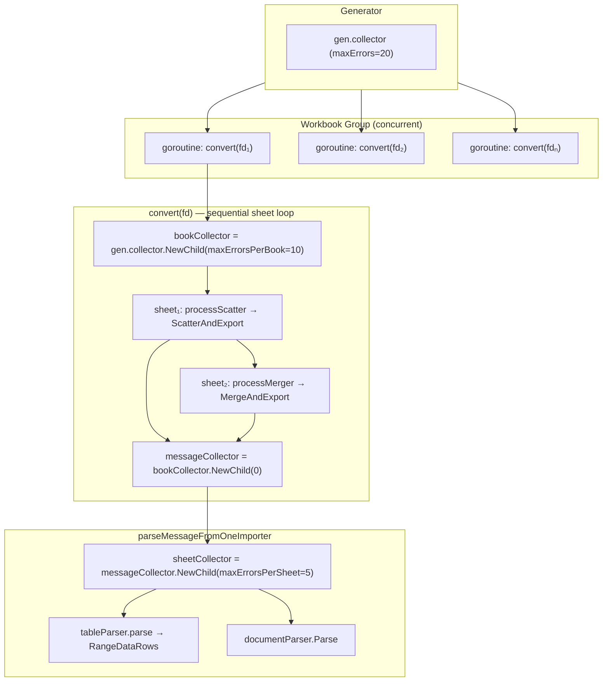
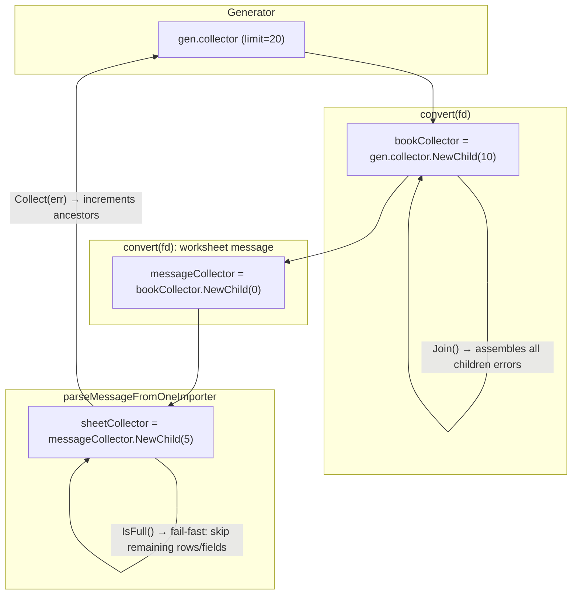

# confgen — Configuration Generation

Converts workbook data (Excel/CSV/XML/YAML) into protobuf messages with
concurrent parsing and a hierarchical error collector for multi-level error limiting.

## Parsing Hierarchy

```
Generator
 ├── GenAll / GenWorkbook
 │    └── collector.NewGroup(ctx)                    ← concurrent workbook batch
 │         └── Group.Go(convert)                     ← one goroutine per proto file
 │
 └── convert(fd)                                     ← sequential per-sheet loop within one workbook
      ├── processScatter → ScatterAndExport
      │    ├── parseMessageFromOneImporter(main)      ← main importer: sequential
      │    └── collector.NewGroup(ctx)                ← concurrent scatter batch
      │         └── Group.Go(parseMessageFromOneImporter)
      │
      └── processMerger → MergeAndExport
           └── ParseMessage
                ├── single importer → parseMessageFromOneImporter   ← sequential
                └── multiple importers
                     └── collector.NewGroup(ctx)                    ← concurrent merge batch
                          └── Group.Go(parseMessageFromOneImporter)
```

### parseMessageFromOneImporter (leaf)

```
parseMessageFromOneImporter(info, messageCollector, impInfo)
 └── sheetCollector = messageCollector.NewChild(maxErrorsPerSheet=5, BookName, SheetName)
 └── sheetParser.Parse(protomsg, sheet)
      ├── [document sheet] → documentParser.Parse
      │    └── parseMessage(node)                    ← recursive tree walk
      │
      └── [table sheet]    → tableParser.Parse
           └── tableParser.parse
                └── RangeDataRows(row callback)
                     └── parseMessage(row)           ← per row
```

## Concurrent Model


```mermaid
flowchart TB
    subgraph Generator
        C["gen.collector (maxErrors=20)"]
    end

    subgraph "Workbook Group (concurrent)"
        direction TB
        G1["goroutine: convert(fd₁)"]
        G2["goroutine: convert(fd₂)"]
        Gn["goroutine: convert(fdₙ)"]
    end

    Generator --> G1 & G2 & Gn

    subgraph "convert(fd) — sequential sheet loop"
        B["bookCollector = gen.collector.NewChild(maxErrorsPerBook=10)"]
        S1["sheet₁: processScatter → ScatterAndExport"]
        S2["sheet₂: processMerger → MergeAndExport"]
        M["messageCollector = bookCollector.NewChild(0)"]
    end

    G1 --> B --> S1 --> S2

    subgraph "parseMessageFromOneImporter"
        SC["sheetCollector = messageCollector.NewChild(maxErrorsPerSheet=5)"]
        TP["tableParser.parse → RangeDataRows"]
        DP["documentParser.Parse"]
    end

    S1 & S2 --> M --> SC --> TP & DP
```

| Level         | Collector                                      | Limit     | Scope                           |
| ------------- | ---------------------------------------------- | --------- | ------------------------------- |
| **Generator** | `gen.collector`                                | 20        | across all concurrent workbooks |
| **Book**      | `bookCollector = gen.collector.NewChild(10)`   | 10        | across sheets in one workbook   |
| **Message**   | `messageCollector = bookCollector.NewChild(0)` | unlimited | one worksheet message           |
| **Sheet**     | `sheetCollector = messageCollector.NewChild(5)` | 5         | one imported sheet              |

## Error Collector

### Hierarchy

Errors are counted at **field level**. The collector tree has limits at book
and imported-sheet levels; the message level groups errors without a separate
limit. `Collect()` increments counters on self and all ancestors. `Join()`
recursively assembles the error tree.

A child collector carries fields shared by its subtree. The book collector
supplies module and primary workbook context; the message collector supplies
the worksheet and protobuf message; each imported-sheet collector
supplies the actual workbook and worksheet names. `Join()` inherits these
fields into each error. `WrapKV` adds fields at the node it wraps; fields on an
individual error remain local to that error.


```mermaid
flowchart TB
    subgraph "Generator"
        Root["gen.collector  (limit=20)"]
    end

    subgraph "convert(fd)"
        Book["bookCollector = gen.collector.NewChild(10)"]
    end

    subgraph "convert(fd): worksheet message"
        Message["messageCollector = bookCollector.NewChild(0)"]
    end

    subgraph "parseMessageFromOneImporter"
        Sheet["sheetCollector = messageCollector.NewChild(5)"]
    end

    Root --> Book --> Message --> Sheet
    Sheet -- "Collect(err) → increments ancestors" --> Root
    Sheet -- "IsFull() → fail-fast: skip remaining rows/fields" --> Sheet
    Book -- "Join() → assembles all children errors" --> Book
```

### Fail-fast Behavior

- **Sheet level**: `sheetCollector.IsFull()` is checked before each row; returns early if full.
- **Book level**: `convert` checks the error returned by `messageCollector.Collect()`; breaks the sheet loop if an ancestor is full.
- **Generator level**: `collector.NewGroup` propagates the first fatal error (book-full) to stop the workbook goroutine.
