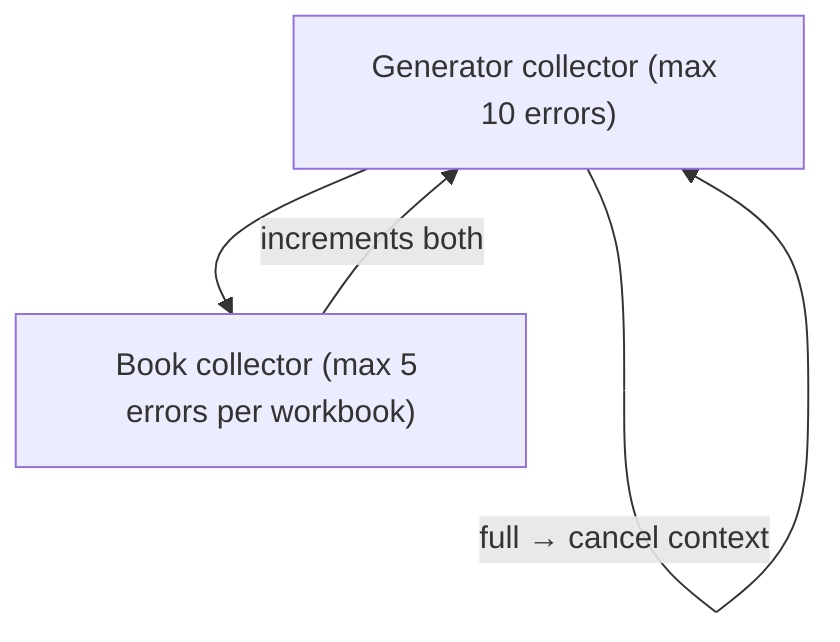

# Protogen

Generates `.proto` files from workbooks (Excel/CSV/XML/YAML).

## Architecture

```
Generator
└── Book (workbook file)
    └── Sheet (worksheet)
        └── Field (column / document node)
            └── SubField (nested, recursive)
```

**Two parsers** handle different input formats:
- **`tableParser`** — column-cursor-based, for tabular formats (CSV/Excel/YAML table)
- **`documentParser`** — node-tree-based, for document formats (XML/YAML document)

Both produce the same IR (`internalpb.Workbook`), which is then rendered to `.proto` by the **exporter**.

## Two-Pass Strategy

Protogen resolves cross-workbook type references via two concurrent passes:

| Pass | Purpose |
|------|---------|
| First | Extract type metadata (enum/struct/union) from special sheet modes into a shared type registry |
| Second | Parse all sheets using resolved types; emit `.proto` files |

`MODE_DEFAULT` sheets are only processed in the second pass.

When generating specific workbooks (`GenWorkbook`), the first-pass scope is configurable:
- **Normal** (default) — scan all workbooks to build a complete type registry
- **Advanced** — load the type registry from previously generated `.proto` files

## Field Layout Detection

For `map`/`list` fields, layout is auto-detected from column naming patterns:

| Layout | Rule |
|--------|------|
| `LAYOUT_VERTICAL` | Single column, no digit suffix |
| `LAYOUT_HORIZONTAL` | Digit-suffixed columns (`Field1`, `Field2`, …) |
| `LAYOUT_INCELL` | Scalar element encoded in a single cell |

Struct fields are detected as cross-cell (`SPAN_DEFAULT`) or inline (`SPAN_INNER_CELL`) based on whether the type descriptor contains embedded field definitions.

## Export Pipeline

```
IR (internalpb.Workbook)
  └── bookExporter
        ├── file header (syntax, package)
        ├── imports + workbook options
        └── sheetExporter (per sheet, per mode)
              ├── MODE_DEFAULT       → message
              ├── MODE_ENUM_TYPE     → enum
              ├── MODE_STRUCT_TYPE   → struct message
              └── MODE_UNION_TYPE    → union + nested enum
```

Key behaviors: field number preservation, nested message deduplication, auto import resolution, file locking for concurrent writes.

## Error Collection

Errors are collected in a **2-level** hierarchy, enabling fail-fast without aborting the entire run:



| Trigger | Action |
|---------|--------|
| Field parse error | Skip remaining fields in current sheet |
| Book collector full | Stop processing sheets in this book |
| Generator collector full | Cancel context; all goroutines exit early |

## Concurrency

Both passes run workbooks concurrently via `errgroup`. The first pass populates `cachedImporters` (guarded by `RWMutex`); the second pass reuses them without re-parsing.
